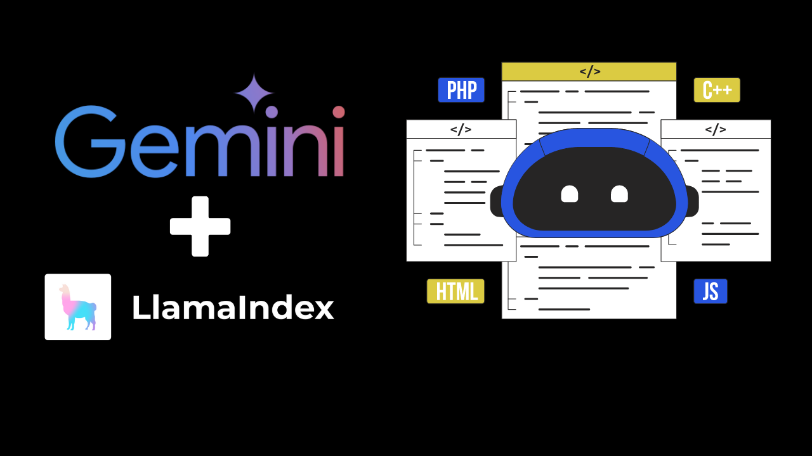

# RAG with Gemini & LLamaIndex for Software Best Practices (example)

In modern software development, ensuring that best practices are followed across teams and projects is essential to maintain code quality, efficiency, and scalability. However, keeping everyone updated on the latest standards and best practices can be a challenge, especially when different teams work on various parts of the codebase.

An AI-powered assistant that can provide instant answers to questions about your company’s coding standards or software best practices can help alleviate this issue. Using Retrieval-Augmented Generation (RAG), you can combine the power of large language models (LLMs) with the ability to search your company’s documentation in real-time, giving employees quick access to guidelines, code examples, and answers to frequently asked questions.

You can read [the complete article](https://dev.to/codewithahsan/ai-assistant-for-company-wide-software-best-practices-with-gemini-llamaindex-rag-nmm-temp-slug-8718691) about this.

## How to run the notebook
- Clone this repository or download the `.ipynb` file.
- Go to [https://colab.research.google.com/](https://colab.research.google.com/)
- Click `File` > `Open notebook`
- Choose the download file
- Follow the rest of the [article](https://dev.to/codewithahsan/ai-assistant-for-company-wide-software-best-practices-with-gemini-llamaindex-rag-5180) :)
